# PatrolScan - Detección y Reconocimiento de Matrículas

## 🚓 Introducción
**PatrolScan** es un sistema avanzado de visión artificial diseñado para la **detección y reconocimiento de matrículas** en tiempo real. Se integra en coches patrulla y opera de forma autónoma, proporcionando información instantánea sobre vehículos a los agentes de la Dirección General de Tráfico (**DGT**)

## Descripción
El producto final es una librería usable en Java y Python que permite la detección y lectura de mátriculas en una o varias imágenes, devolviendo como resultado una lista de matrículas encontradas. Para ello se desarrolla un pipeline de procesamiento de imágenes que incluye:
- Detección de la matrícula en la imagen
- Extracción del texto de la matrícula
- Reconocimiento del texto de la matrícula
- Comparación del resultado con una base de datos de matrículas
El sistema principal se desarrolla en Python, y mediante el uso de un wrapper de Java se integra en el sistema operativo Android, permitiendo su uso en los coches patrulla de la DGT, sin la necesidad del guardado o envio de las imágenes a un servidor, o proceso externo. Esto permite un funcionamiento con poca latencia, y seguridad en el tratamiento de los datos.

## ✨ Características principales
- 📸 **Captura de imágenes en tiempo real** desde cámaras de distinta resolución instaladas en los coches patrulla.
- 🤖 **Reconocimiento óptico de caracteres (OCR)** mediante tecnologías de visión artificial.
- 🔍 **Cruce de datos** con bases de datos de la DGT.
- 🌐 **Funcionamiento en local**, sin necesidad de conexión a internet.
- ⚡ **Procesamiento rápido y eficiente**, con respuesta en tiempo real.
- 🎛 **Adaptable a distintas condiciones ambientales**, como baja luz o niebla.

## 🛠 Tecnologías utilizadas
- **Lenguajes:** Java (Android Auto), Python (procesamiento de imágenes)
- **Librerías:** OpenCV, YOLOv11, Tesseract OCR
- **Hardware:** Hardware instalado en el coche patrulla
- **Infraestructura:** Proceso ejecutando en local en el coche patrulla

## 🏗 Arquitectura del sistema
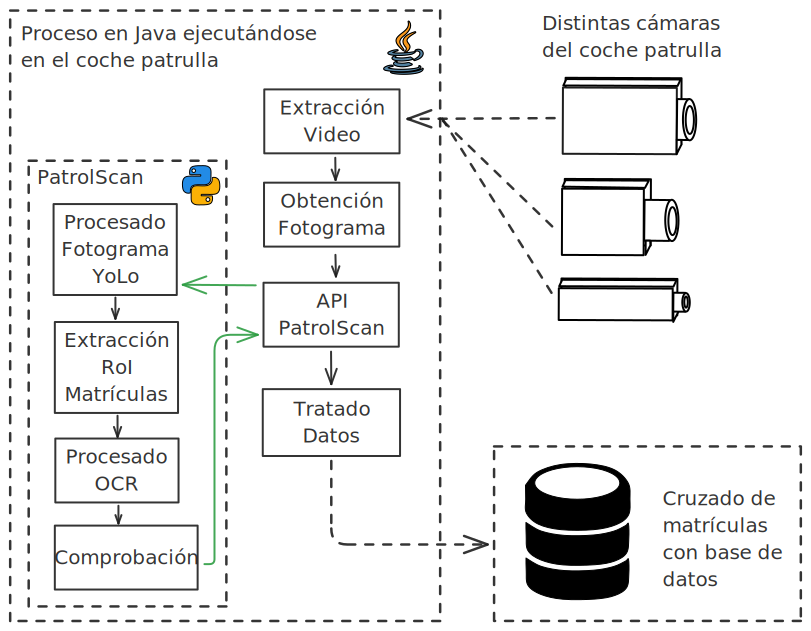

## 🚀 Instalación y uso
### Requisitos
[Próximamente]

### Instalación
Para el módulo Python esta información se encuentra en `python/README.md` 
Para el módulo Java esta información se encuentra en `patrol-scan/README.md`

### Uso
[Próximamente]

## 📸 Ejemplos de funcionamiento

### Ejemplo 1: Escenario: Coche estacionado al aire libre en un día nublado.
1. **Entrada:** Una imagen capturada por la cámara del coche patrulla.
    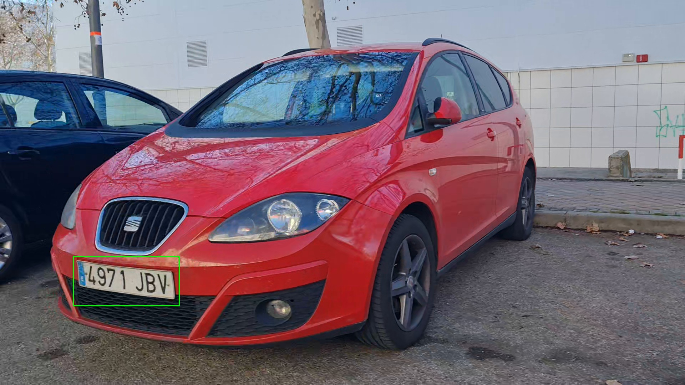

2. **ROI:** Recorte de la zona:
   

        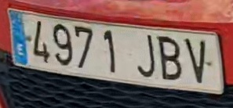
        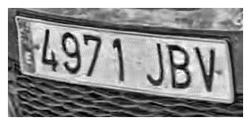
        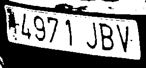
    

3. **Resultado:** Matrícula detectada: `4971JBV`
    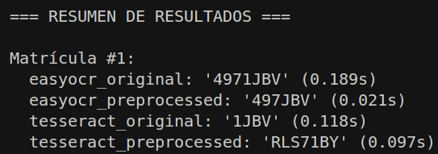

### Ejemplo 2: Escenario: coches aparcados en un garaje con poca iluminación.
1. **Entrada:** Imagen con varios vehículos.
   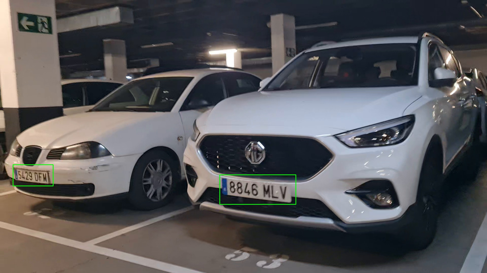

    En esta ocasión, `PatrolScan` ha sido capaz de detectar la matrícula de dos coches.
    Se hace el recorte de la zona donde está la matrícula y también se aplica la técnica de preprocesamiento de imagen para evaluar el funcionamiento del OCR.

2. **ROI:** Recortes de las zonas:
   Matrículas del coche izquierdo.

   

        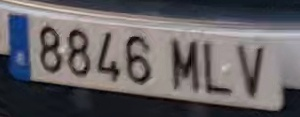
        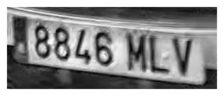
        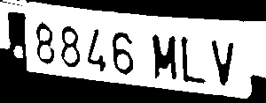
    

    Matrículas del coche derecho.

   

        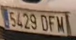
        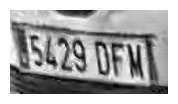
        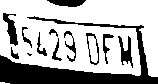
    

3. **Resultado:** Matrículas detectadas: `8846MLV`, `5429DFM`
    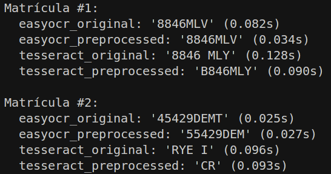

## 🏗 Diagramas UML

### Diagrama de clases

#### Diagrama de clases del módulo Python

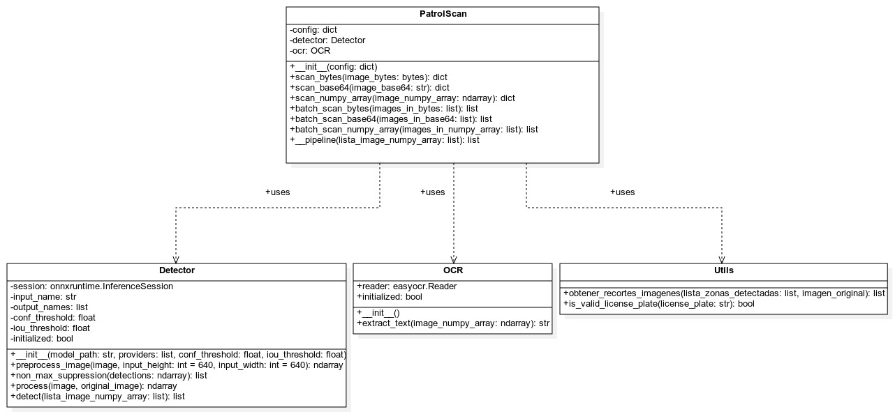

#### Diagrama de clases del módulo Java

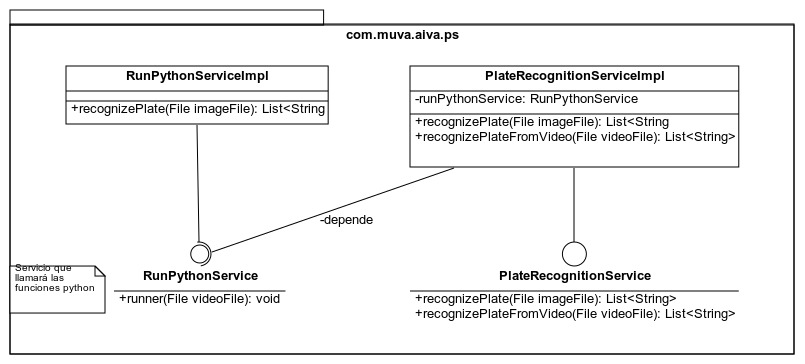

### Diagrama de secuencia

#### Diagrama de secuencia del módulo Python

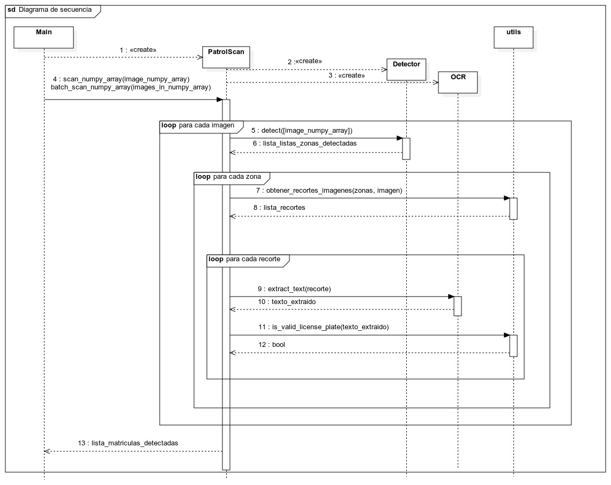

#### Diagrama de secuencia del módulo Java

### Diagrama de actividad

#### Diagrama de actividad del módulo Python

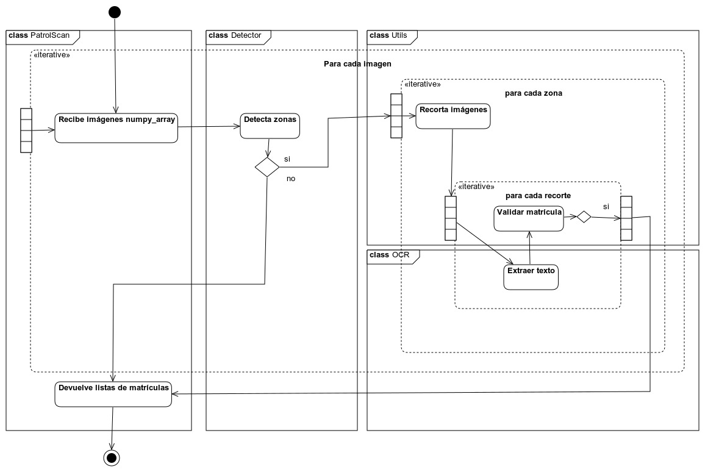

#### Diagrama de actividad del módulo Java

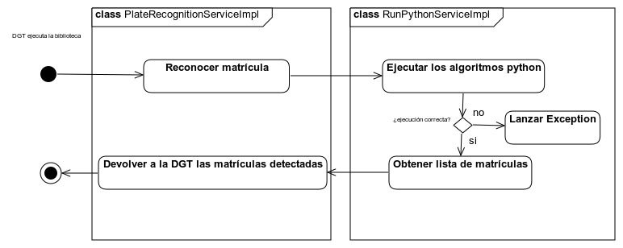
