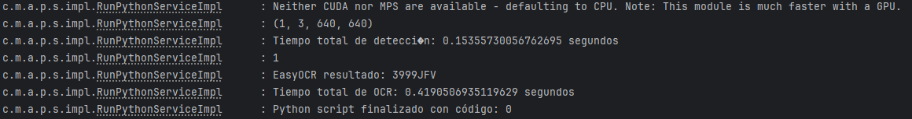
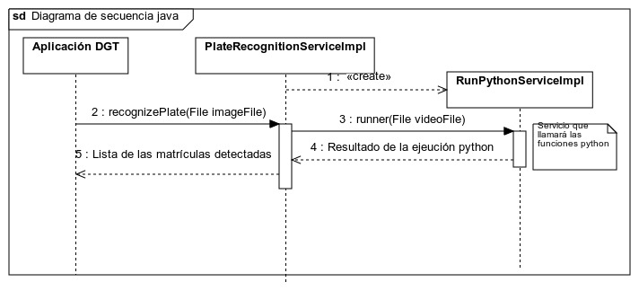

# PatrolScan - Java
Esta librería permite invocar algoritmos en Python para la detección y reconocimiento de las matrículas vehiculares.

La aplicación de la Dirección General de Tráfico (DGT) podrá integrar esta librería para procesar imágenes capturadas por cámaras de los coches patrulla.
A través de esta integración, la aplicación podrá analizar las imágenes en tiempo real o de manera offline para verificar si el vehículo tiene alguna incidencia como: multas, restricciones de circulación, etc.

## 🚀 Tecnologías utilizadas

- Java 21
- Maven 3.8.6
- Lombok
- JUnit / Mockito
- Spring Boot

## 📦 Instalación

Para instalar la librería, primero debemos clonar el repositorio e instalar el módulo de Java:

```bash
git clone https://github.com/AngelicaGuaman/AIVA_2025
cd AIVA_2025/patrol-scan
mvn clean install
```

### 🔬 Versión

#### Pruebas de funcionamiento

Para verificar el funcionamiento de la biblioteca, ejecuta la clase de prueba `PlateRecognitionServiceTest`.

#### Requisitos previos

Es necesario definir la variable de entorno `PYTHON_PATH` o definir en el `application.properties` la variable `patrolscan.python.path`, la cual debe apuntar al entorno de Python que contiene todas las bibliotecas requeridas para la detección y reconocimiento de matrículas.

#### Ejecución de pruebas

Para ejecutar las pruebas, utiliza el siguiente comando:
```bash
mvn clean install
```

#### Resultado:



## 🚀 Uso
```xml
<dependency>
    <groupId>com.muva.aiva.ps</groupId>
    <artifactId>patrol-scan-lib</artifactId>
    <version>0.0.1-SNAPSHOT</version>
</dependency>
```

## 🏗 Diagramas UML

### Diagrama de clases


### Diagrama de secuencia



### Diagrama de actividad

