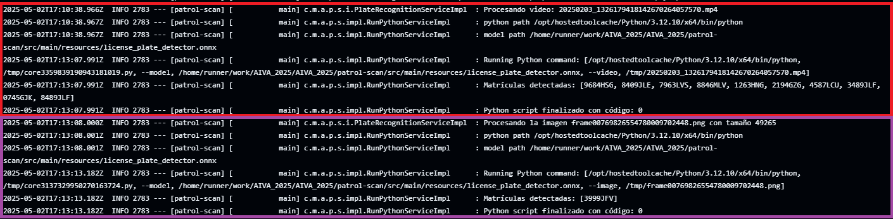
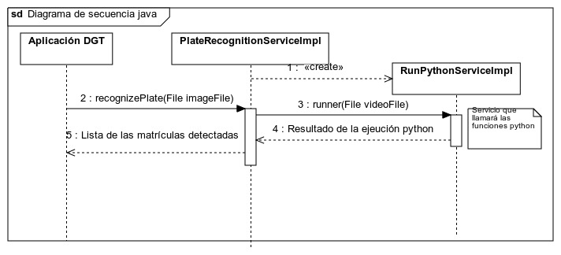

# PatrolScan - Java


Esta librería permite invocar algoritmos en Python para la detección y reconocimiento de las matrículas vehiculares.

La aplicación de la Dirección General de Tráfico (DGT) podrá integrar esta librería para procesar imágenes capturadas por cámaras de los coches patrulla.
A través de esta integración, la aplicación podrá analizar las imágenes en tiempo real o de manera offline para verificar si el vehículo tiene alguna incidencia como: multas, restricciones de circulación, etc.

## 🚀 Tecnologías utilizadas

- Java 21
- Maven 3.8.6
- Lombok
- JUnit / Mockito
- Spring Boot

## 📦 Instalación

A continuación, sigue los pasos para instalar y configurar correctamente la librería:

1. **Clona el repositorio:**

```bash
git clone https://github.com/AngelicaGuaman/AIVA_2025
cd AIVA_2025/patrol-scan
```

2. **Define las variables de entorno requeridas:**

Estas variables se utilizan para configurar la ruta del intérprete de Python y el modelo ONNX.

```bash
export PYTHON_PATH="C:\\muva\\AIVA_2025\\python\\virtual_patrol_dev\\Scripts\\python.exe"
export MODEL_PATH="C:\\muva\\AIVA_2025\\modelos\\license_plate_detector.onnx"
```

O también puedes definirlas en el fichero `aplication.properties` para ejecutarlo en local.

```bash
patrolscan.python.path=${PYTHON_PATH:"C:\\muva\\AIVA_2025\\python\\virtual_patrol_dev\\Scripts\\python.exe"}
patrolscan.python.model=${MODEL_PATH:"C:\\muva\\AIVA_2025\\modelos\\license_plate_detector.onnx"}
```

3. **Ubicación de los ficheros `core.py` y del modelo ONNX:**

El fichero `core.py` se encuentra en la ruta `python/src/patrolscan/core.py`. Este fichero contiene el flujo del algoritmo Python.<br>
Para que la integración funcione correctamente, este archivo debe ser copiado en el directorio `src/main/resources` del módulo Java.<br>
Esto se hace así para evitar duplicar el fichero; ya que esto puede generar inconsistencias. Durante el proceso de CI/CD (GitHub Actions) se copiará automáticamente dentro del `.jar`.

El modelo `license_plate_detector.onnx` está ubicado en este repositorio en la ruta `modelos` o en la variable de entorno `MODEL_PATH`.

4. **Compilar:**

```bash
cd AIVA_2025/patrol-scan
mvn clean install
```

### 🔬 Versión

#### Pruebas de funcionamiento

Para verificar el funcionamiento de la biblioteca, ejecuta la clase de prueba `PlateRecognitionServiceTest`.

#### Requisitos previos

Es necesario definir la variable de entorno `PYTHON_PATH` y `MODEL_PATH`. Estas deben apuntar al entorno de Python que contiene todas las bibliotecas requeridas para la detección y reconocimiento de matrículas y su modelo.

#### Ejecución de pruebas

Para ejecutar las pruebas, utiliza el siguiente comando:
```bash
mvn clean install
```

#### Resultado:



## 🚀 Uso
```xml
<dependency>
    <groupId>com.muva.aiva.ps</groupId>
    <artifactId>patrol-scan-lib</artifactId>
    <version>0.0.1-SNAPSHOT</version>
</dependency>
```

## 🏗 Diagramas UML

### Diagrama de clases


### Diagrama de secuencia



### Diagrama de actividad

