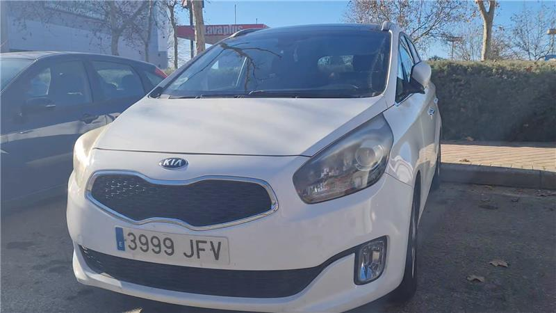
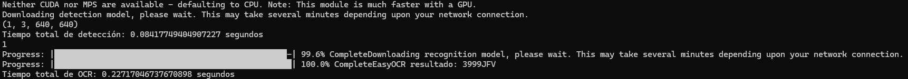

# PatrolScan - Python


## 📦 Instalación

Asegúrate de tener Python 3.12 o superior instalado. El paquete `setuptools` es necesario, pero normalmente ya viene con Python. Si no lo tienes, puedes instalarlo con:

```bash
pip install setuptools
```

Para instalar la librería, primero debemos clonar el repositorio e instalar el módulo de python:

```bash
git clone https://github.com/AngelicaGuaman/AIVA_2025
cd AIVA_2025/python
pip install -e .
```

### 🔬 Versión alpha

Para ejecutar los tests unitarios, que actualmente son mocks, podemos usar el siguiente comando, debemos instalar la versión de desarrollo del paquete:

```bash
pip install -e .[dev]
pytest
```

Para poder utilizar PatrolScan es necesario el modelo `license_plate_detector.pt` que no se encuentra subido en el repositorio público, junto con su dataset.

## 📸 Ejemplos de funcionamiento

En la [documentación principal](../README.md) se puede observar ejemplos detallados del funcionamiento de PatrolScan.

## 🚀 Uso

```bash
python main.py license_plate_detector.onnx data/frame0076.png
```

## 🐳 Uso con Docker

A continuación, se indican los pasos a seguir para construir, etiquetar, publicar y ejecutar una imagen docker en un entorno local.

### Construir y publicar la imagen Docker

1. **Construir la imagen Docker**  
   Ejecuta el siguiente comando para construir la imagen Docker y etiquetarla correctamente:

   ```bash
   docker build . -t ghcr.io/angelicaguaman/aiva_2025/patrolscan-python:latest
   ```

2. **Publicar la imagen en el registro de GitHub (GHCR)**  
   Primeramente se inicia sesión en GitHub Container Registry con el siguiente comando:

   ```bash
   docker login --username github_user --password ***** ghcr.io
   ```

   Luego, se publica la imagen con el siguiente comando:

   ```bash
   docker push ghcr.io/angelicaguaman/aiva_2025/patrolscan-python:latest
   ```

### Ejecutar el contenedor Docker

Para levantar un contenedor Docker, no es necesario que la imagen esté publicada en un registry; basta con que esté disponible localmente.<br>
Con el siguiente comando podremos ver el funcionamiento de PatrolScan.

```bash
docker run --rm ghcr.io/angelicaguaman/aiva_2025/patrolscan-python python main.py license_plate_detector.onnx data/frame0076.png
```

En el caso que no exista la imagen en el entorno local hay que ejecutar el siguiente comando:

```bash
docker pull ghcr.io/angelicaguaman/aiva_2025/patrolscan-python:latest
```

### Notas importantes

- **Archivos requeridos**: 
  - `license_plate_detector.onnx`: El modelo necesario para la detección de matrículas.
  - `data/frame0076.png`: La imagen que se procesará.

### Resultado del contenedor Docker

#### Imagen a procesar


#### Resultado de PatrolScan



## 🏗 Diagramas UML

### Diagrama de clases


### Diagrama de secuencia


### Diagrama de actividad


