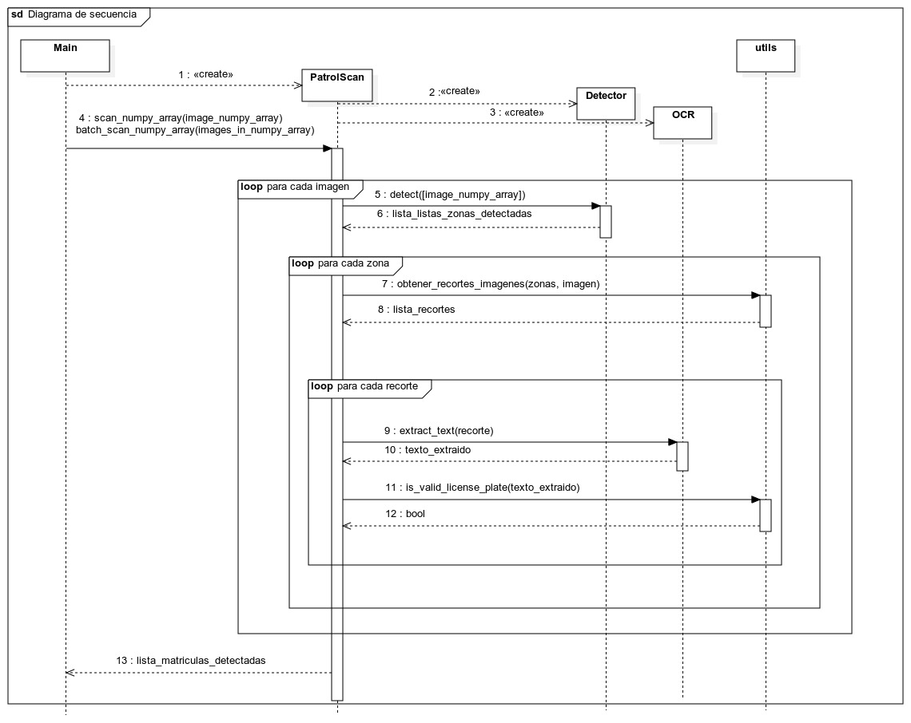
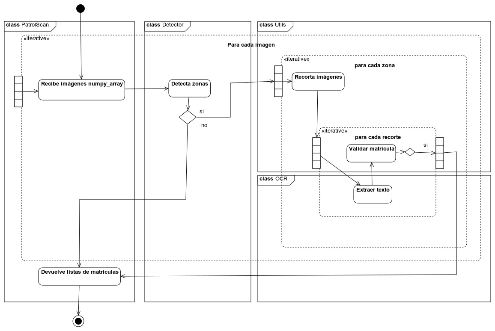

# PatrolScan - Python

## 📦 Instalación

Asegúrate de tener Python 3.12 o superior instalado. El paquete `setuptools` es necesario, pero normalmente ya viene con Python. Si no lo tienes, puedes instalarlo con:

```bash
pip install setuptools
```

Para instalar la librería, primero debemos clonar el repositorio e instalar el módulo de python:

```bash
git clone https://github.com/AngelicaGuaman/AIVA_2025
cd AIVA_2025/python
pip install -e .
```

### 🔬 Versión alpha

Para ejecutar los tests unitarios, que actualmente son mocks, podemos usar el siguiente comando, debemos instalar la versión de desarrollo del paquete:

```bash
pip install -e .[dev]
pytest
```

Para poder utilizar PatrolScan es necesario el modelo `license_plate_detector.pt` que no se encuentra subido en el repositorio público, junto con su dataset.

## 🚀 Uso

[Próximamente]


## 🏗 Diagramas UML

### Diagrama de clases


### Diagrama de secuencia



### Diagrama de actividad


